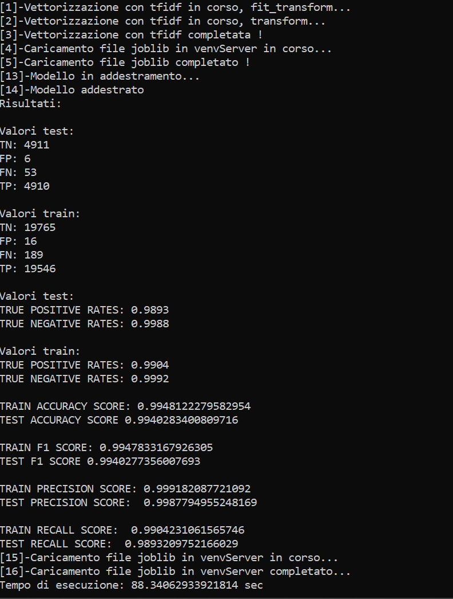

# Analysis_And_Generation_Model_ML

__BEFORE READING THIS REPOSITORY IT IS RECOMMENDED TO START FROM:__

https://github.com/insidbyte/Analysis_and_processing

___OPZIONI:___
 
    1)-GENERATE MODEL

    2)-TEST WITH HYPERPARAMETER TUNING

    3)-PLOT WITH TFIDF VECTORIZER AND SVD TRUNCATED REDUCTION

### Menù

__Starting the ModelsGenerator.py file from the terminal it will appear:__

#  ___OPTION 1:___
### Model generation:

# Kaggle IMDb dataset example:

### ***I created a Client in Angular to send requests to a Python Server*** 

# CLIENT: 

# SERVER:

# RESPONSE FROM THE SERVER:

# ANOTHER EXAMPLE:

#  ___OPTION 2:___
### Test hyperparameters with gridsearchCV and tfidf vectorizer:

***A good way to automate the test phase and save time searching for the best parameters to***
***generate the most accurate model possible is to use GrisearchCV made available by scikit-learn***
***The code in ModelsGenerator.py must be customized based on the dataset to be analyzed***
### ***WARNING !! ***
### ***beware if we don't study the scikit-learn documentation we could start infinite analyzes***
### ***so it is always advisable to know what we are doing ***
